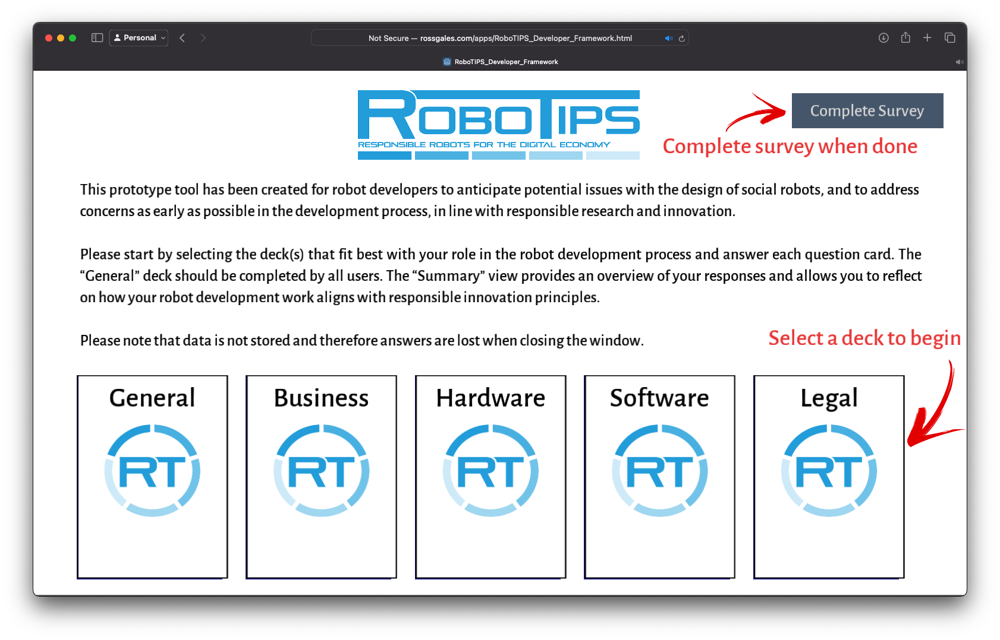
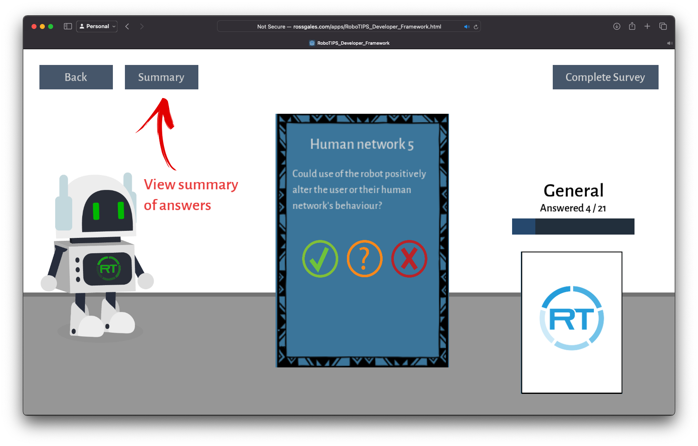
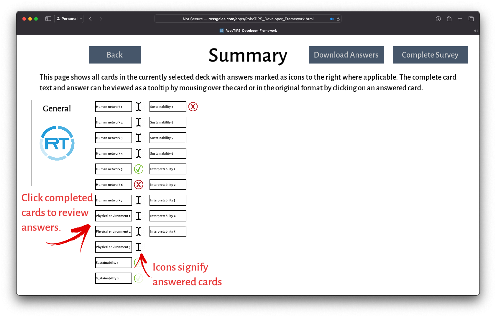

# RoboTIPS Developer Framework
This repository contains code for the implementation of the RoboTIPS Developer Framework, part of the EPSRC-funded [RoboTIPS project](https://www.robotips.co.uk), led by Professor Marina Jirotka at the [University of Oxford](https://www.cs.ox.ac.uk/research/HCC/).

As part of this work, we are testing the usefulness and usability of a responsible robotics framework designed for roboticists. The framework has been developed as a web interface consisting of a series of closed and open-ended questions.

## Tool

## Implementation
The code for the tool has been developed using the open-source game development engine [Godot 3.6](https://godotengine.org/)

## License
This software is currently not licensed for public distribution. This repository has been created as a demonstration of the work and the tool remains the property of the RoboTIPS project.

## ToDo
- If last card is open text field type, and is submitted with no text entered, the card is not re-dealt. It cannot be answered without exiting to main page and opening the deck again.
- It is possible to double-click multi-choice answer and have two new cards dealt at once.
- Fix Summary buttons marked blue on click
- `_on_LastCardButton_button_up` -- back button skips last card in answered queue, also shows skipped open-text card,
- Fix the blue button 'pressed' on the summary page (and the grey 'back' button on zoomed summary)
- Possibly remove the summary tooltip in favour of the full-screen card based summary which has also been implemented
